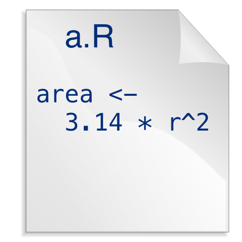
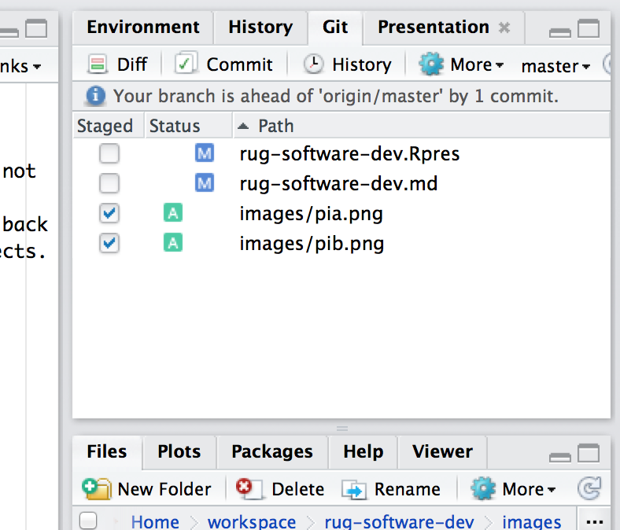

Revision Control & Testing
========================================================
author: Jeff Allen
date: December 7, 2013
transition: rotate

### https://github.com/trestletech/rug-software-dev

Quick Poll
==========
incremental: true

- Used revision control before (Subersion, CVS, Mercurial, Git, etc.)?
- Used Git before?
- Used automated testing before?

Revision Control
==================================
type: section

Revision Control Motivation
===========================

### "This function used to work!"
Inspect provenance of any file in your project.

### "Please send me the code you used here."
Might be some publication from years ago.

### "Let's work together!"
Take turns & merge? Live update? Will have problems.

### "I found a bug in your code and fixed it."

Revision Control
================

December 1

***

December 4

Revision Control
================

- Maintain your own copy ("**working copy**") of the code. Never edit the central copy.
- Track changes to a set of files ("**commits**") over time with custom granularity.
- Record messages alongside each commit to record what you did.

***

Revision Control, Cont'd.
=========================

***

- Revert any file -- or the whole set -- back to any point in the project's history.
- Maintain multiple versions ("**branches**") in parallel in one location ("**repository**").
- Collaborate by contributing your changes ("**commits**") to a central server.

Why Git?
========

Git is a modern, distributed revision control system.

- "Modern"
  - Learned from past implementations
  - Better branching and merging
- "[Distributed](http://hginit.com/00.html)"
  - Commit, refine, clean locally before sharing with others
  - Multi-authority -- changes to code can come from multiple sources
  - Always nice to have a copy in your control

GitHub
======

- Typically want an authoritative copy of your Git repository somewhere.
- GitHub hosts (and backs up) Git repositories for you.
- Also provides a web interface with a litany of incredible features.
  - Compare different copies of your code
  - User-friendly "diff"s
  - Team-based access management to your projects
  - Free hosting for open-source

GitHub Definitions
==================

- **Fork** -- To clone a copy of someone else's repository into your own. May not have write permissions on the original repository, do have them on your copy.
- **Pull Request** -- To submit changes you've made in your fork of a project back to the original project. How GitHub enables contributions to open-source projects.

Git Clients
===========

- Software comes with command line interfaces
- GitHub offers a nice Mac/Windows client if you're on GitHub
- RStudio supports Git (and SVN), if installed.
  - Powerful interface if you're doing R development

***

Automated Testing
==================================
type: section

Testing Intro
=============

