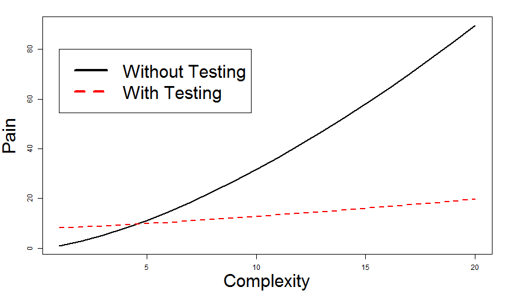

<style type="text/css">

.indent {
  padding-left: 2em !important;
}

.centered {
  width: 100%;
  margin-left: auto;
  margin-right: auto;
  text-align: center;
}

.large {
  font-size: 1.2em !important;
  line-height: 64px !important;
}
</style>

Revision Control & Testing
========================================================
author: Jeff Allen
date: December 7, 2013
transition: rotate

### https://github.com/trestletech/rug-software-dev

Quick Poll
==========
incremental: true

- Used revision control before (Subersion, CVS, Mercurial, Git, etc.)?
- Used Git before?
- Used automated testing before?

Revision Control
==================================
type: section

Revision Control Motivation
===========================

### "This function used to work!"
<span class="indent">Inspect provenance of any file in your project.</span>

### "Please send me the code you used here."
<span class="indent">Might be some publication from years ago.</span>

### "Let's work together!"
<span class="indent">Take turns & merge? Live update? Will have problems.</span>

### "I found a bug in your code and fixed it."

Revision Control
================


<div style="text-align: center; width: 100%;">December 1</div>
***

<div style="text-align: center; width: 100%;">December 4</div>

Revision Control
================

- Maintain your own copy ("**working copy**") of the code. Never edit the central copy.
- Track changes to a set of files ("**commits**") over time with custom granularity.
- Record messages alongside each commit to record what you did.

***

Revision Control, Cont'd.
=========================

***

- Revert any file -- or the whole set -- back to any point in the project's history.
- Maintain multiple versions ("**branches**") in parallel in one location ("**repository**").
- Collaborate by contributing your changes ("**commits**") to a central server.

Why Git?
========

Git is a modern, distributed revision control system.

- "Modern"
  - Learned from past implementations
  - Better branching and merging
- "[Distributed](http://hginit.com/00.html)"
  - Commit, refine, clean locally before sharing with others
  - Multi-authority -- changes to code can come from multiple sources
  - Always nice to have a copy in your control

GitHub
======

- Typically want an authoritative copy of your Git repository somewhere.
- GitHub hosts (and backs up) Git repositories for you.
- Also provides a web interface with a litany of incredible features.
  - Compare different copies of your code
  - User-friendly "diff"s
  - Team-based access management to your projects
  - Free hosting for open-source

GitHub Definitions
==================

- **Fork** -- To clone a copy of someone else's repository into your own. May not have write permissions on the original repository, do have them on your copy.
- **Pull Request** -- To submit changes you've made in your fork of a project back to the original project. How GitHub enables contributions to open-source projects.

Git Clients
===========

- Software comes with command line interfaces
- GitHub offers a nice Mac/Windows client if you're on GitHub
- RStudio supports Git (and SVN), if installed.
  - Powerful interface if you're doing R development

***


Automated Testing
==================================
type: section

Manual Testing Process
======================

<div class="large">1. Write some code.</div>
<div class="large">2. Try running it. Does it seem to work?</div>
<div class="indent large">(2a. Try some different input. Still work?)</div>
<div class="large">3. If yes, Great! Go back to #1.</div>
<br />
<div class="large">Works when testing a small, isolated function.</div>

Manual Testing Growing Pain
===========================
left: 40%

## What about when you grow?

- Multiple nested functions
- Change the inner-most function?
  - Test it and all ancestors...
- What about a bug in a utility function?

***


```r
foo <- function(x, y){
  bar(x) + y
}

bar <- function(x){
  if (x > 0){
    return(x + 14)
  }
  return (3)
}

```


Automated Testing
=================

- Formalize all the "sanity checks" you already do
- Write code that describes how you expect a function to behave
- Develop a suite of tests that cover your code
  - Know immediately if you broke anything
  - Ensure no old bug creeps back in
  - Formally document behavior of your code
  - Approach old code with confidence

Takeaway
========

 


Testing in R
============
left: 40%

We'll use the [TestThat](https://github.com/hadley/testthat) package for testing
 
 - Automated test execution when your code changes
 - Works great with packages
 - Visual reporters to summarize results of testing

***


```r
> test_package("shiny")
bootstrap : ........
garbage coll : ......
Shiny Input : ..1......
reactivity : ...........
tags : ...........
text : ................
URL : ..

1. Failure: Matrix converts list of lists to matrix

Error: Test failures
```


TestThat Example
================


```r
library(testthat)

# Define a single test
test_that("Everything works", {  
  # Define the expectations that 
  # constitute this test.
  expect_equal(2+2, 4)
  expect_true(5 > 3)
  expect_false(3 * 4 == 11)
  expect_error("r" + 4)
})
```


Hands-On
==================================
type: section

Problem
=======
left: 40%

- Often need to square numbers in R.
- Want to write a reusable function that will square numbers for us.

***


```r
#' Square a number
#'
#' @param x The number
#'   to square.
square <- function(x){
  # Magic here!
}

square(2)
```


```
[1] 4
```


Testing Example - Squaring
==========================
left: 55%

## Code


```r
square <- function(x){
  sq <- 0
  for (i in 1:x){
    sq <- sq + x
  }
  return(sq)
}
```


***

## Tests


```r
library(testthat)
expect_equal(
  square(3), 9
) # Passes

expect_equal(
  square(5), 25
) # Passes
```


Test-Driven Development (TDD)
=============================
incremental: true

If you see a bug:

<ol start="0">
<li>Document/report it (Optional)</li>
<li>Write a test that fails</li>
<li>Fix the bug</li>
<li>Show that the test now passes</li>
<li>Commit to revision control</li>
</ol>

Tests Failing
=============
left: 55%

## Code


```r
square <- function(x){
  sq <- 0
  for (i in 1:x){
    sq <- sq + x
  }
  return(sq)
}
```


***

## Tests


```r
library(testthat)
expect_equal(
  square(-2), 4
) # Fails

expect_equal(
 square(1.1),1.21
) # Fails
```


Tests Passing
=============
left: 55%

## Code


```r
square <- function(x){
  sq <- x * x
  return(sq)
}
```


***

## Tests


```r
library(testthat)
expect_equal(
  square(-2), 4
) # Passes

expect_equal(
 square(1.1), 1.21
) # Passes
```


Testing Timing
==============
left: 35%

## Code


```r
square <- 
function(x){
  x^2
}
```


***

## Tests


```r
time <- system.time({
  for (i in 1:1000000){
    square(2)
  }
})
expect_true(
  time[3] < 0.8
) # Passes

cat(time[3], "s")
```

```
0.72 s
```


Resources
=========

## Revision Control & Git

- [Practical strategies for branching and merging](http://nvie.com/posts/a-successful-git-branching-model/)
- [GitHub Help](https://help.github.com/)


***

## Testing in R

- [TestThat GitHub Page](https://github.com/hadley/testthat/)
- ["Testing" chapter in *Advanced R Programming*](http://adv-r.had.co.nz/Testing.html)

